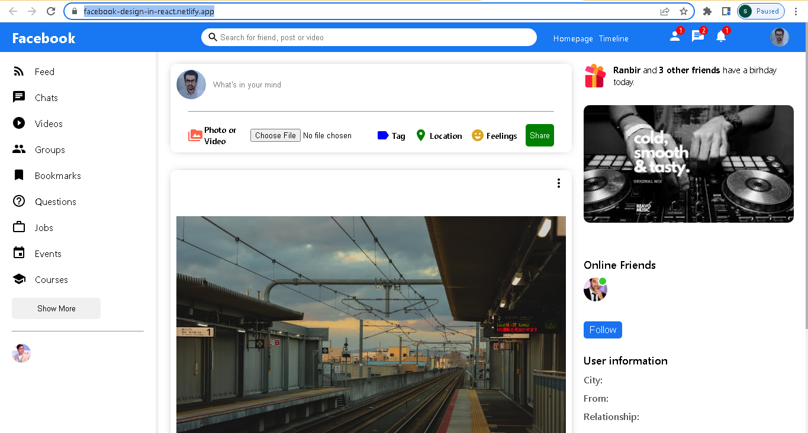

Hosted link: https://facebook-design-in-react.netlify.app/  

This is Facebook Design build in React using material-ui. 
localhost:3000/ is our Home  
localhost:3000/login is our Login  
localhost:3000/messenger is our Messenger  
localhost:3000/register is our Register  

Home is divided into 3 region using flexbox for Sidebar,Feed,Rightbar.
Sidebar has contains  Chats,Videos,Groups,Bookmarks,Questions,Jobs,Events,Courses. 
While in Feed user can share his views,upload pictures,tag someone,express feeling,show location. 
while on Rightbar it contains HomeRightbar,ProfileRightbar. HomeRightbar notify general information like birthday of others. ProfileRightbar notify information about online friends and current user information like City,From,Relationship.

